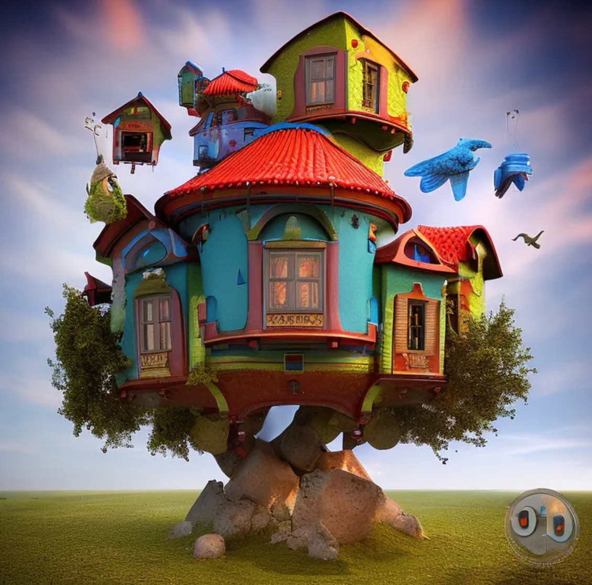
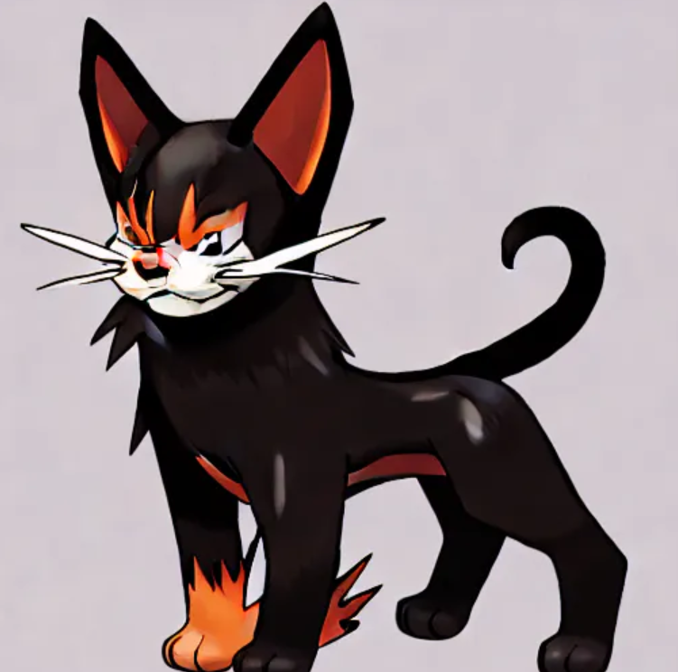

# Adrian Chrysanthou - AI & Technology Resume

Hello, and thank you for reading through my recent work in AI, the Web, Discord Bots, and much more!

You can view a copy of my resume [HERE](https://www.adrianchrysanthou.com/adrian_chrysanthou_resume-2024.pdf)

## 🔗 Links

## 💬 Acknowledgements

 - [Elgato Marketing highlighting my Stream Deck Cookie Clicker game ](https://x.com/elgatomarket/status/1786430546488476114)
 - [AI 2.0 Forum QnA Panelist](https://www.linkedin.com/feed/update/urn:li:activity:7180550543566635008/)
 - [Create AI-Powered Art using text prompts from your own custom Discord.js Bot](https://medium.com/@f00d4tehg0dz/create-ai-powered-art-using-text-prompts-from-your-own-custom-discord-js-bot-bddd05742f6e)

# 🚀 Examples of my Work

## 👩‍💻 Example One

**Fly to locations in a 3D mapped environment using ChatGPT and Google Maps API in Unreal Engine 5** 

[**Higher Framerate Video Demo**](https://i.imgur.com/I6sZdO0.mp4)

* A conceptual project utilizing user location prompts into ChatGPT, flying the user to the specified x and y coordinates in a 3D Google Maps and Unreal Engine 5 experience.
* Utilizing OpenAI ChatGPT 3.5turbo LLM and their REST API. Typing in your desired location is translated to x and y coordinates in Unreal Engine 5 through Google Maps API. Visually flying the user to the correct location and using Google Map Tiles is displayed through Cesium in a 3D environment

[**Demo Game**](https://drive.google.com/file/d/1qxqKGCxKJKcA0gsqPmUE0R--dc5TqCkt/view?usp=share_link) 
* Hold down Left Click to fly around WSAD for Throttle Up/Down, Left, and Right Spacebar to open Postcard. 

[**Project Code**](https://github.com/f00d4tehg0dz/FlyThroughGoogleMaps)

* OpenAI ChatGPT 3.5 turbo LLM
* Google Maps API
* Google Maps Tiles API
* Unreal Engine 5
* Cesium

## 👩‍💻 Example Two

**ChatGPT guesses what you are thinking**

<!--[**Video Demo**](https://i.imgur.com/Mq4aA14.mp4)-->

* Mindguesser is built as a proof of concept in the spirit of the late 1990s web game Akinator.
* Utilizing OpenAI ChatGPT 4 LLM, a custom-built backend API and Next.js frontend. MindGuesser has 20 questions to guess what you are thinking! 

[**Demo Website**](https://mindguesser.com/) 

[**Here is the Frontend Code**](https://github.com/f00d4tehg0dz/MindGuesser-Frontend/tree/master)

* React-based application with TailwindCSS
* Frontend is hosted on Vercel

[**Here is the Backend Code**](https://github.com/f00d4tehg0dz/MindGuesser-Backend/tree/main)

* The backend node package is hosted on a personal VPS with PM2 handling startup
* Leverages rate-limiting, cors, and express
* OpenAPI key is stored environment variable
* Database is using MongoDB

## 👩‍💻 Example Three

**GenAI (StableDiffusion) and ChatGPT generator Discord Bot**

<!--  -->

* A Discord bot to chat with and generate music and images via text prompts! All are powered by StableDiffusion AI Models and ChatGPT 3.5 chat layer
* Utilizing OpenAI ChatGPT 3,5 turbo LLM, several StableDiffusion versions, miniDalle and Discord.js. With an optional Patreon subscription, you can generate images and ask questions to access the latest StableDiffusion Model and faster generation.

[**Artibot Website**](https://www.artibot.gg/) 

[**Codebase**](https://github.com/f00d4tehg0dz/ai-chat-discord-bot)

* Built with Discord.js v14 with a multitude of commands and modularity built-in
* Using WebSockets to access Gradio StableDiffusion generation capabilities from HuggingFace hosting
* OpenAPI key is stored environment variable 
* Hosted on a personal VPS with PM2 handling startup
* Database is using MySQL

## 🛠 Development Skills

**Web:** 

* JS/TS, HTML, CSS/SASS, Git, Docker, PHP, Python, React, Vue.js, Next.js, REST API,s MQTT, WebSockets, UI/UX

**Game Development:** 

* Unreal Engine 5, Unreal Engine 4

**AI**

* Dataset building. Training for a variety of GenAI. Utilizing variety of GenAI tools and software packages

**So much more!**

## My Home Lab

#### Hardware

* 1x AMD 5600x 64GB DDR4, 512GB NVME Samsung Pro, Ubuntu 22LTS 
  - Hosting docker containers for a variety of services, including NGINX with RTMP, Neko, Powerpanel, [Custom-built KASM service](https://github.com/f00d4tehg0dz/kasm-discord-screenshare), TeslaMate, [Minecraft](https://minecraft.f00d4tehg0dz.me).

* 1x 9900k, 64GB DDR4, 512GB NVME Samsung Pro, 120TB RAW, TrueNAS Scale 
  - Hosting the multitude of K8s and a VPN with a killswitch

* 1x ASUS 10Gig WiFi 6E Router running custom firmware with AdGuard and similar PiHole features

* 1x TPLINK 2.5gig Wifi 6E Router for PCVR wireless game streaming

* 3x 10gig switches, including TP-Link and Netgear throughout the house
